# Rapport
## I. Création du Budget sur AWS 
### - Création du budget par défaut
1. On rentre dans notre profil

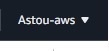

2. On rentre dans gestion de facture et des coût

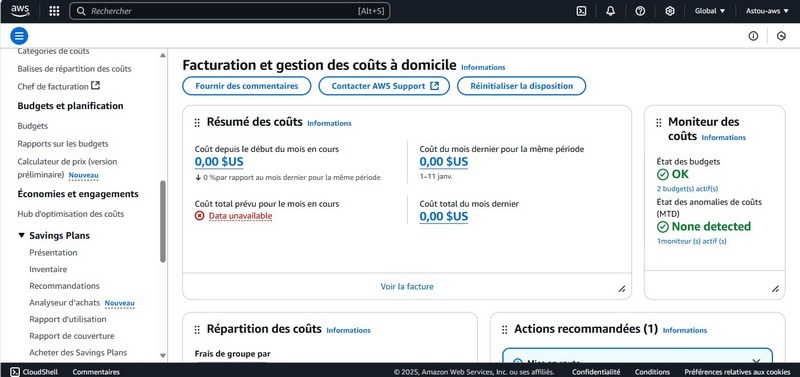

3. On rentre dans budget

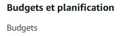

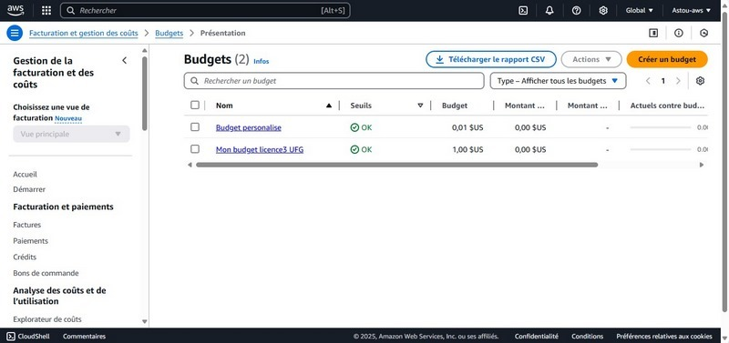

4. On clique le bouton de création pour créer un budget

5. On choisi le type de budget

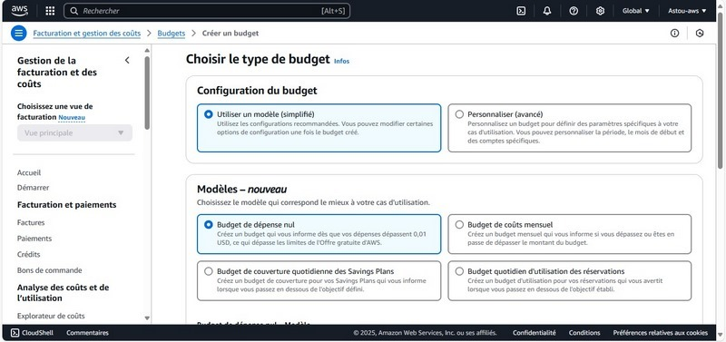

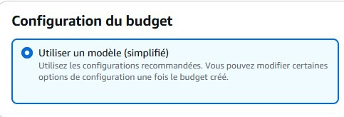

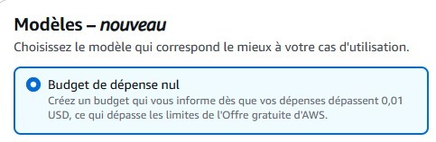

6. On click sur le bouton créer un budget

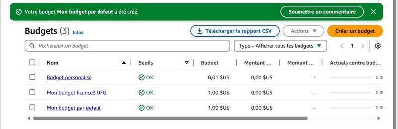

### - Création du budget personnalisé
1. On rentre dans notre profil

2. On rentre dans gestion de facture et des coût

3. On rentre dans budget

4. On clique le bouton de création pour créer un budget

5. On choisi le type de budget

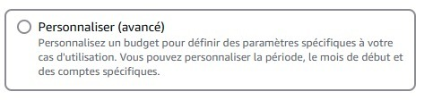

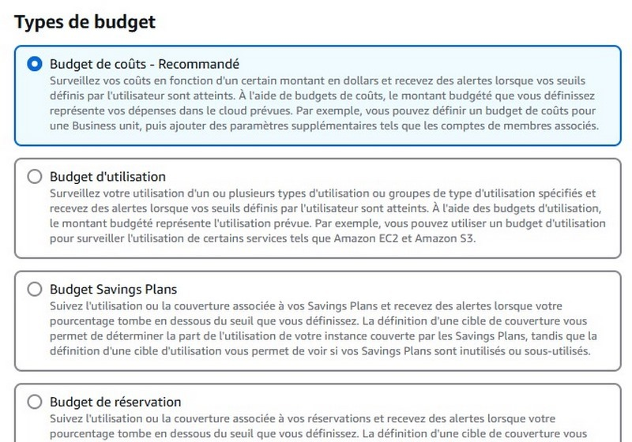

6. On clique sur le bouton suivant

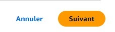

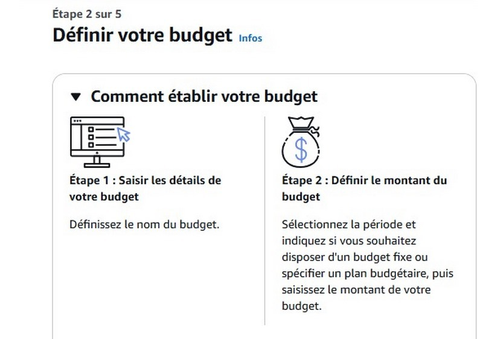

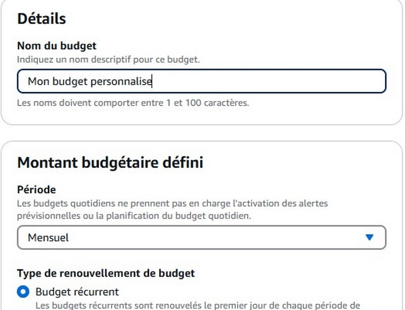

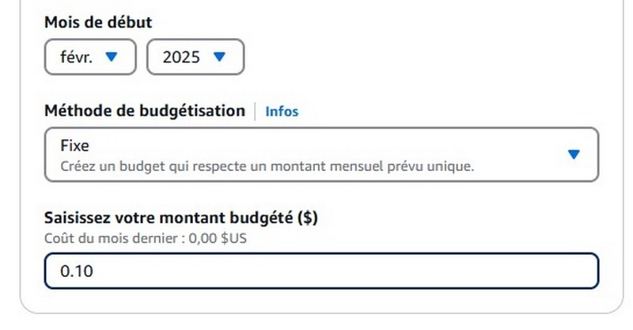

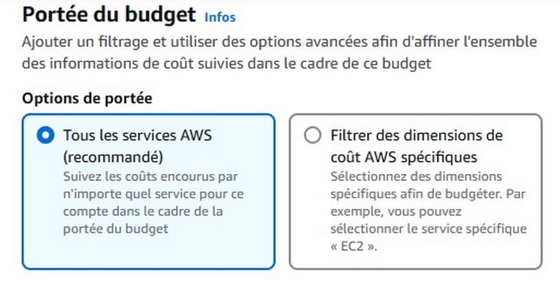

7. On clique sur le bouton suivant

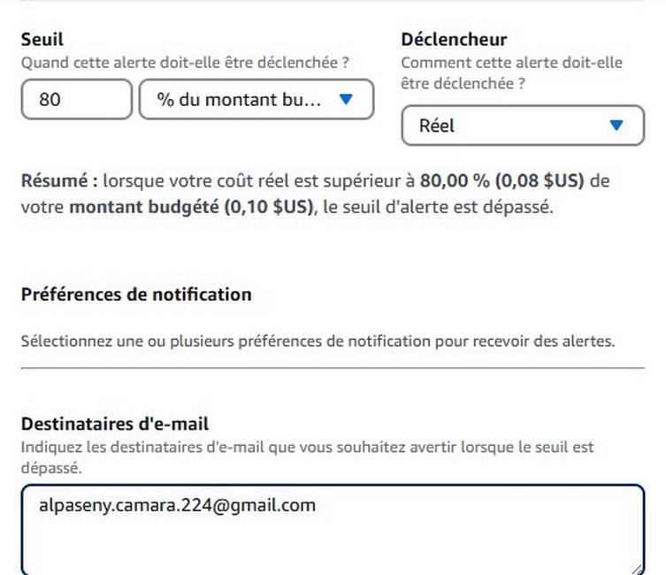

8. On clique sur le bouton créer un budget

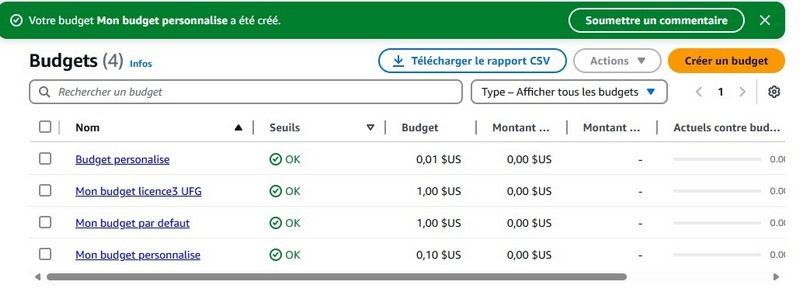

### Comment changer le moyen de payement
1. On clique dans gestion de facture et des coûts

2. On rentre dans préférence de paiement

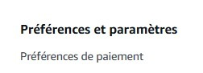

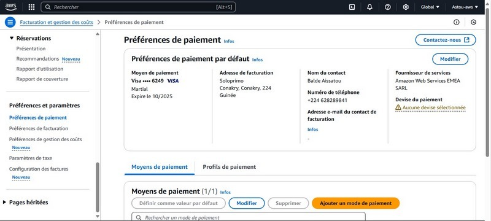

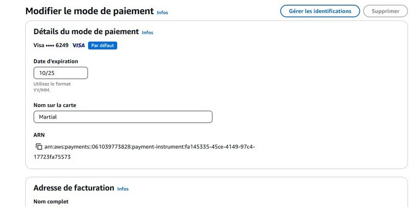

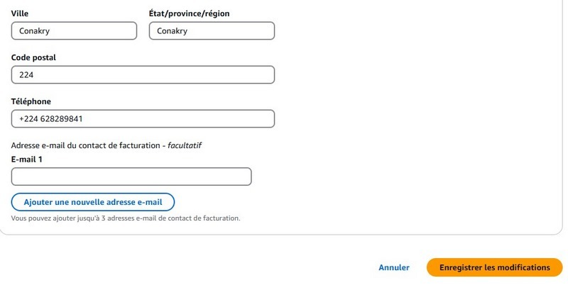

### Créer un compte utilisateur

1. On recherche IAM dans la barre de recherche

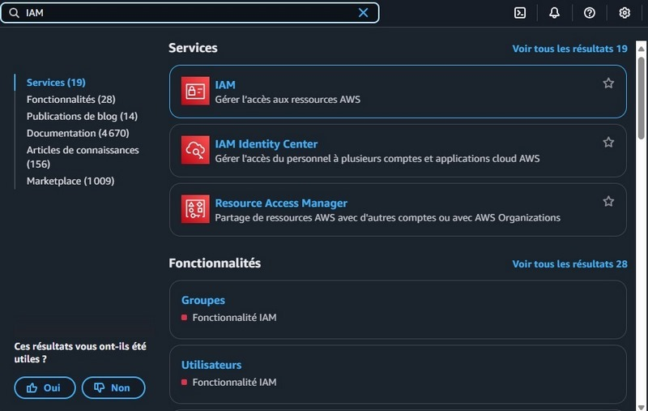

2. On rentre dans le tableau de bord de IAM

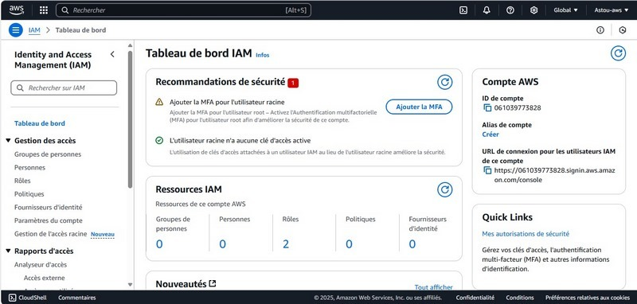

3. On rentre dans le menu personnes

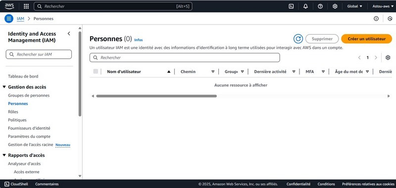

4. On renseigne les informations d'un utilisateur

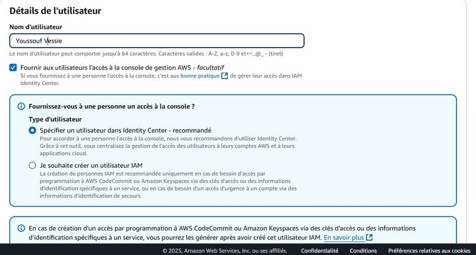

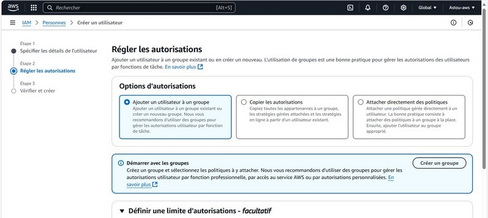
 
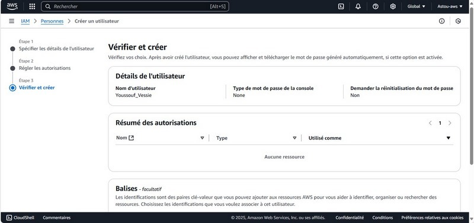

5. Puis on créer un utilisateur

