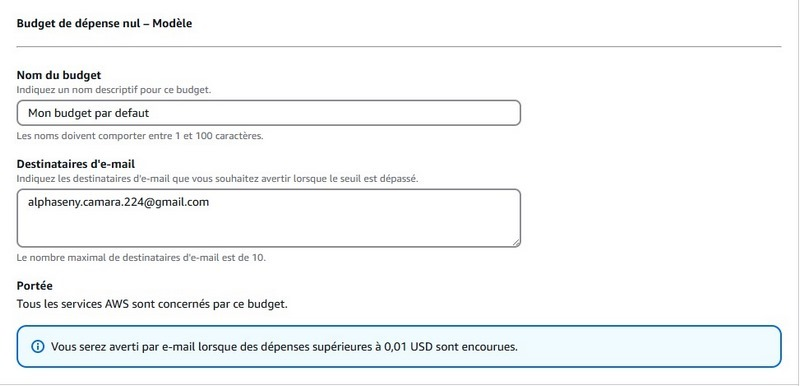
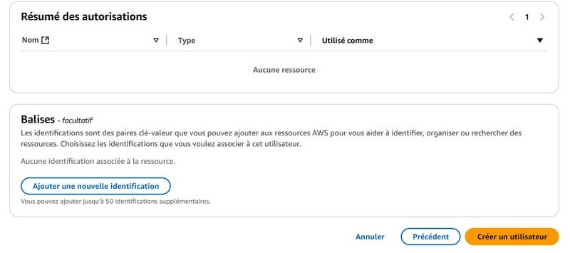

# Rapport
## I. Création du Budget sur AWS 
### - Création du budget par défaut
1. Ont rentre dans notre profil

2. Ont rentre dans gestion de facture et des coût

3. Ont rentre dans budget

4. Ont clique le bouton de création pour créer un budget

5. Ont choisi le type de budget

6. Ont click sur le bouton créer un budget

### - Création du budget personnalisé
1. Ont rentre dans notre profil

2. Ont rentre dans gestion de facture et des coût

3. Ont rentre dans budget

4. Ont clique le bouton de création pour créer un budget

5. Ont choisi le type de budget

6. Ont clique sur le bouton suivant

7. Ont clique sur le bouton suivant

8. Ont click sur le bouton créer un budget

### Comment changer le moyen de payement
1. Ont rentre dans gestion de facture et des coûts

2. Ont rentre dans préférence de paiement

### Créer un compte utilisateur

1. Ont recherche IAM dans la barre de recherche

2. Ont rentre dans le tableau de bord de IAM

3. Ont rentre dans le menu personnes

4. ont met les informations d'un utilisateur

 

5. Puis ont créer un utilisateur

